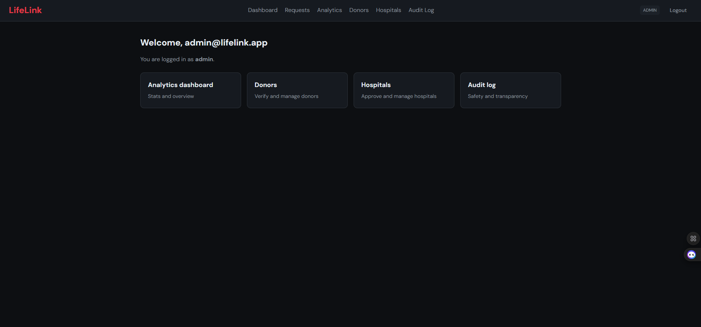
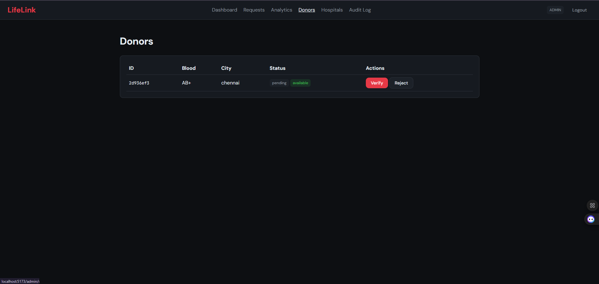
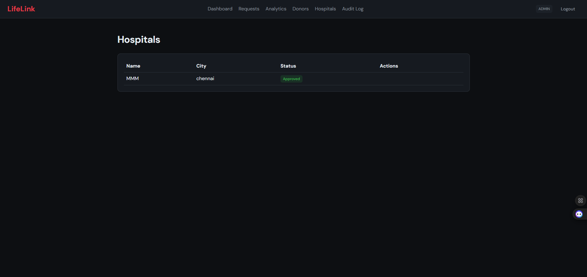
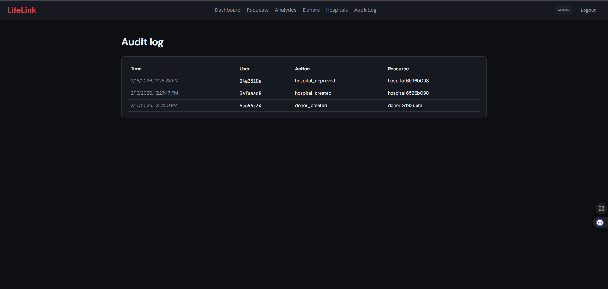
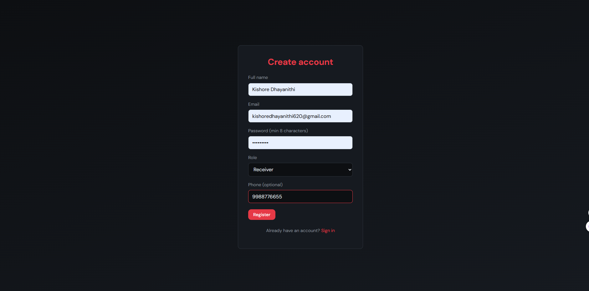
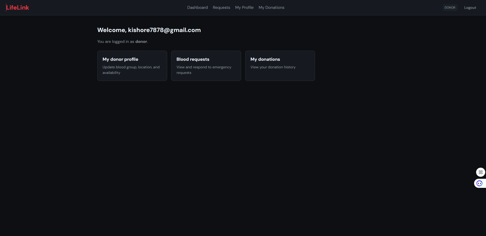

# LifeLink – Blood Bank Management Platform

I built **LifeLink** as a full-stack blood bank management system to connect **donors**, **hospitals**, and **receivers** in real time. The main goal of this project is to reduce emergency response time for blood requests by using live donor availability, smart matching, and instant notifications.

## What this project does

- Secure role-based authentication (Admin, Donor, Receiver, Hospital)
- Donor and hospital profile management
- Emergency blood request creation and tracking
- Nearest eligible donor matching using location and blood group compatibility
- Real-time notifications via WebSocket (with optional SMS/Email integrations)
- Admin analytics and audit logging

---

## Technology Stack

### Frontend
- React 18 + TypeScript
- Vite
- React Router
- CSS

### Backend
- Node.js + Express + TypeScript
- JWT authentication
- WebSocket (`ws`) for real-time updates
- Zod for validation

### Databases & Infrastructure
- PostgreSQL (core relational data)
- MongoDB (logs/activities)
- Redis (cache + online presence)
- Docker & Docker Compose (optional containerized setup)

---

## Requirements

Before running this project, make sure you have:

- **Node.js 20+**
- **npm 9+**
- **PostgreSQL 16+**
- **MongoDB 7+**
- **Redis 7+**
- **Docker Desktop + Docker Compose** (optional but recommended)

> Note: This project does not use Python, so there is no `requirements.txt`. Dependency requirements are managed through `package.json` files.

---

## Installation & Setup

### 1) Clone the project

```bash
git clone <your-repository-url>
cd bloodbank
```

### 2) Install all dependencies

```bash
npm run install:all
```

This installs dependencies for:
- root workspace
- backend
- frontend

### 3) Configure environment variables

Create `.env` from the sample file:

```bash
cp .env.example .env
```

Then update required values in `.env` (at minimum, `JWT_SECRET` and database connection URLs).

### 4) Start required databases

#### Option A (Recommended): Docker

```bash
docker compose up -d postgres mongodb redis
```

#### Option B: Local services

Start PostgreSQL, MongoDB, and Redis locally, then initialize Postgres schema:

```bash
psql -U postgres -d lifelink -f backend/src/db/init.sql
```

### 5) Seed admin account (optional)

```bash
cd backend
npx tsx src/db/seed.ts
```

Default admin login:
- **Email:** `admin@lifelink.app`
- **Password:** `Admin@123`

### 6) Run backend

```bash
cd backend
npm run dev
```

Backend URLs:
- API: `http://localhost:4000`
- WebSocket: `ws://localhost:4000/ws`

### 7) Run frontend

```bash
cd frontend
npm run dev
```

Frontend URL:
- App: `http://localhost:5173`

---

## Docker (full app)

To run full stack with Docker:

```bash
docker compose up -d
```

---

## Key API Modules

- `/api/v1/auth` – registration/login/current user
- `/api/v1/donors` – donor profile and verification flow
- `/api/v1/hospitals` – hospital profile and approval flow
- `/api/v1/requests` – blood request lifecycle and donor responses
- `/api/v1/analytics` – admin dashboard and audit logs

---

## Screenshots

### Page 1


### Page 2


### Page 3


### Page 4


### Page 5


### Page 6


### Page 7


---


